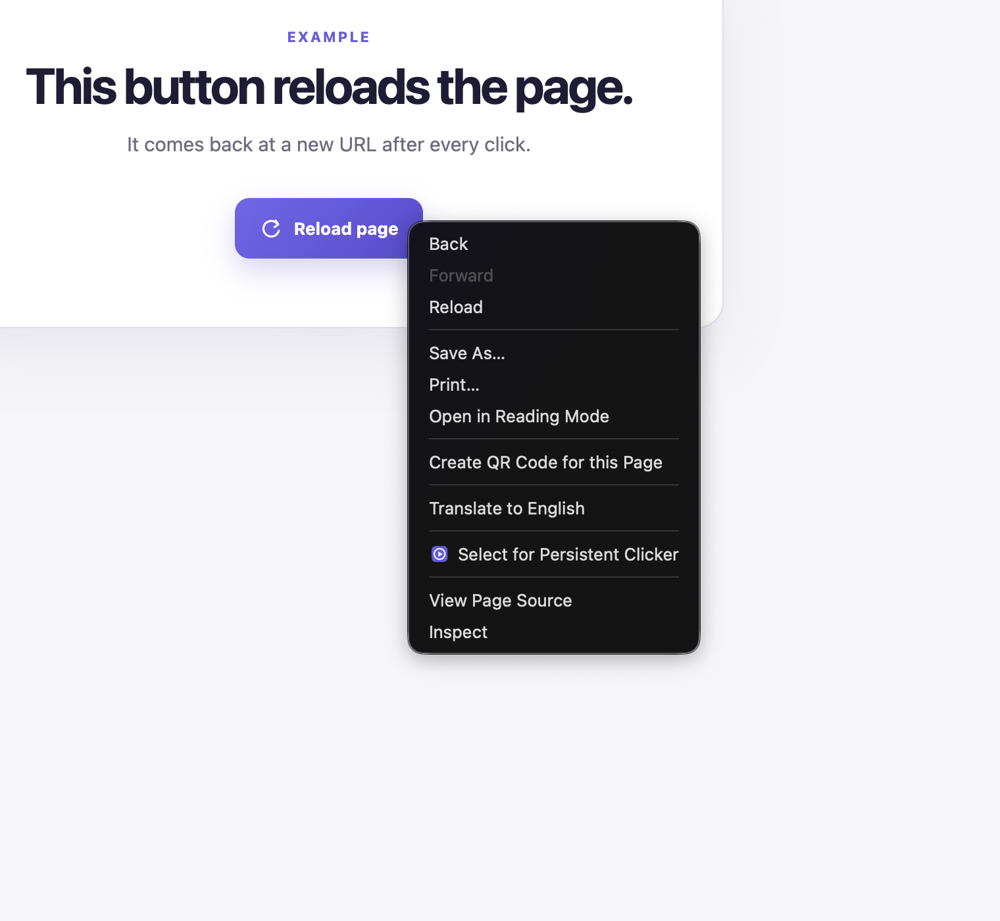
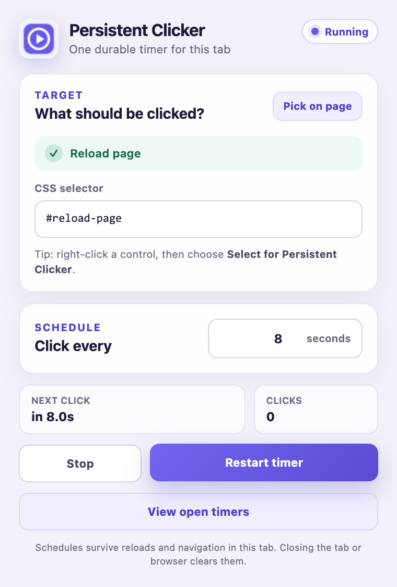
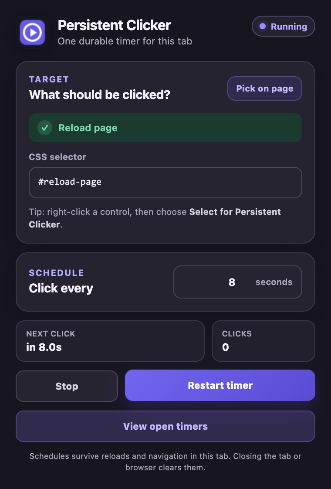
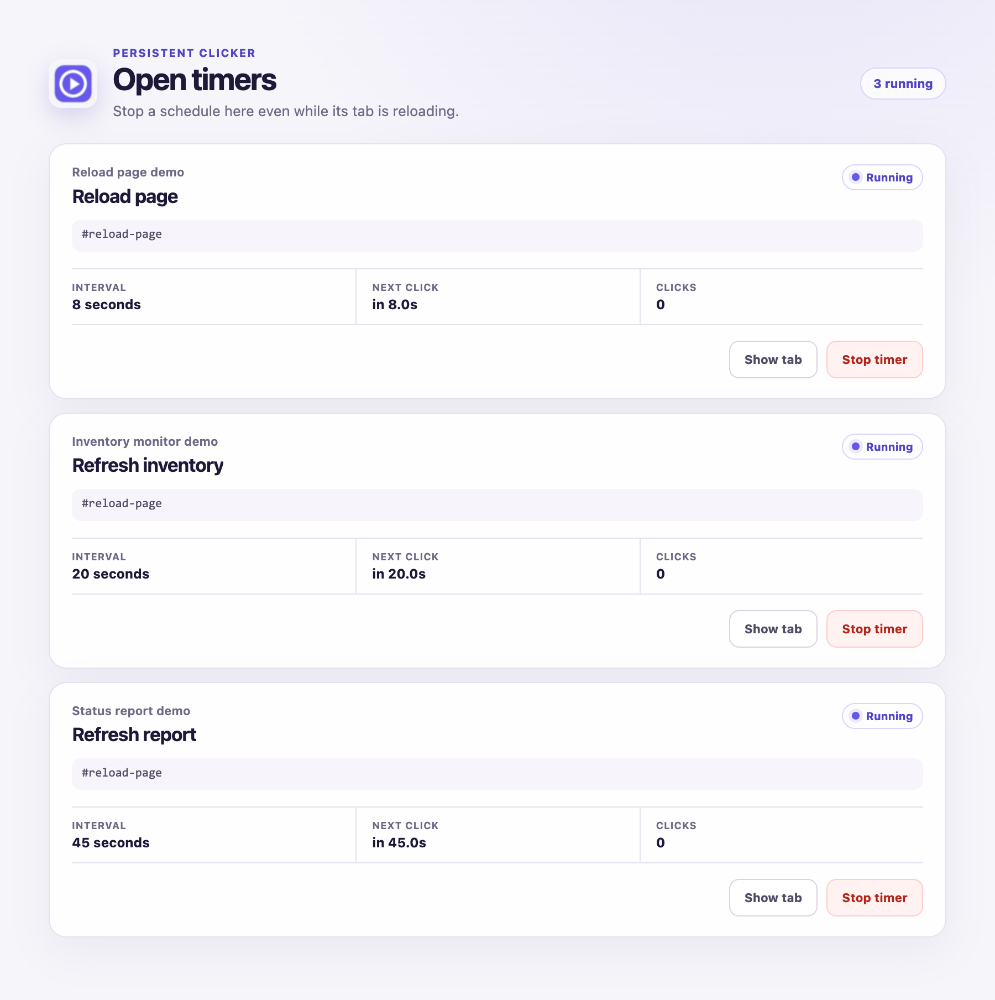
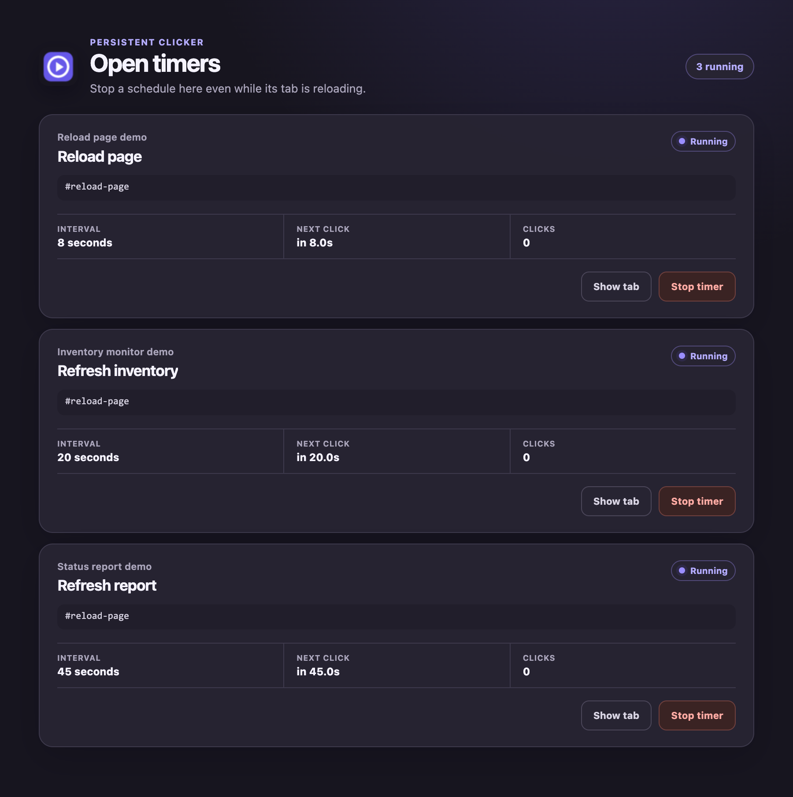
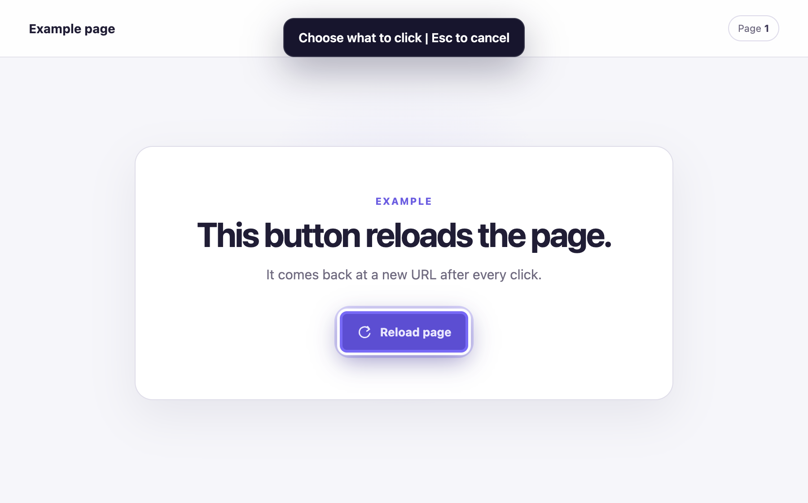

# Persistent Clicker

## Why

Right-click any button, choose an interval, and Persistent Clicker keeps clicking it even when a click reloads the page or navigates the tab.

## Install

1. Open `chrome://extensions` in Google Chrome or another Chromium browser.
2. Enable **Developer mode**.
3. Choose **Load unpacked** and select the cloned project folder.
4. Pin **Persistent Clicker** from the extensions menu.

For local `file://` pages, also enable **Allow access to file URLs** on the extension's details page.

## Use

1. Right-click the button or control and choose **Select for Persistent Clicker**. Right-clicking its icon or text selects the nearest actionable control.
2. Open the extension, set the interval in seconds, and choose **Start clicking**.
3. Leave the tab open. The extension waits for the same selector after every reload or navigation, clicks once when it is ready, and resumes the cadence without replaying missed intervals.
4. Choose **Stop** in the popup, or use the open-timers dashboard when finished.



The popup's **Pick on page** button provides a visual selector, and the CSS selector remains editable for unusual pages. Selecting a new target pauses the tab's existing schedule.

The popup and dashboard follow the browser's light or dark system appearance.

<p> </p>

## Open timers

Choose **View open timers** in the popup, or right-click the extension's toolbar icon and choose **Open timer dashboard**. The dashboard stays open while target tabs reload, lists every running schedule, and lets you show its tab or stop it immediately.

<p> </p>

## Playground

The automated playground has one button that reloads into the same structure at a new URL, making the persistence case reproducible.



## Behavior and limits

State lives in Manifest V3 session storage, keyed by tab ID. Before each DOM click, the extension stores the next due time; the destination page's content script then rebuilds a single timeout from that state. Closing the tab, restarting the browser, reloading the extension, or disabling it clears the schedule.

Persistent Clicker runs only in top-level HTTP, HTTPS, and user-enabled file pages. Chromium blocks content scripts on internal pages such as `chrome://` and the Chrome Web Store. A missing, hidden, or disabled target stays in a waiting state until it becomes available. The extension sends no page data anywhere and has no runtime dependencies.

If a page was already open when the extension was installed or reloaded, the first picker or start action reconnects it without reloading the page.

## Development

```sh
npm ci
npm run browser:install
npm test
npm run test:e2e
npm run screenshots
```

The browser installer downloads Playwright's version-matched Chrome for Testing build into its browser cache. Browser commands load the unpacked extension into an isolated temporary profile and delete that profile afterward. End-to-end checks run headlessly; screenshot capture stays headed so macOS can capture Chrome's native right-click menu. Override the executable when needed with `PERSISTENT_CLICKER_BROWSER=/path/to/chrome-for-testing`.

`npm run screenshots` regenerates the native menu, picker, popup, dashboard, and Chrome Web Store artwork from deterministic local fixtures. `npm run verify` runs the complete automated check.

## Release

```sh
npm run release:check
```

The release check verifies the extension in Chrome for Testing and writes a deterministic Chrome Web Store ZIP to `dist/`. The archive contains only extension runtime files and places `manifest.json` at its root.

[Store listing copy and submission notes](store-assets/listing.md) accompany the required listing images in `store-assets/`. [The privacy policy](PRIVACY.md) documents the extension's local-only handling of selectors, schedules, page controls, and tab titles.

Licensed under [AGPL-3.0-only](LICENSE).
